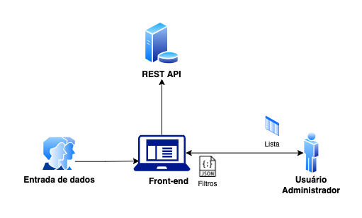

# 🕦 📅 📏 **Filtros com data**

## **Descricão do problema & abordagem inicial**

Este é um caso de uso muito comum e que serve muito bem para exemplificar como utilizar boas práticas de gerenciamento de datas e horas pode facilitar a implementação de features.

Considere uma aplicação simples em que o usuário administrador visualiza uma lista de itens com algumas opções de filtro. Os dados são introduzidos no sistema por um outro grupo de usuários:

<figure align="center">
</img>
<figcaption align="center"><b>Fig.1 - Arquitetura do sistema exemplo</b></figcaption>
</figure>

Conforme a imagem, uma arquitetura tradicional para resolver este problema envolve uma aplicação front-end que envia dados via JSON para uma API REST que processa a requisição e retorna os itens adequados de um banco de dados.

Imagine que inicialmente o sistema apresenta apenas o requisito de filtrar os itens criados em um dia. Temos algumas possibilidades de implementação para um endpoint que lida com essa busca. Esta seria uma proposta inicial:

*Endpoint:* `GET /api/buscar-itens/` 

*Payload:*
```
{
  <...>,
  dia: "24/12/2022"
}
```

*Retorno:*
```
{
  dados: [
    { <...>, criado_em: "24/12/2022" },
    { <...>, criado_em: "24/12/2022" },
  ]
}
```
Apesar de resolver o problema proposto, a solução acima tem muito espaço para melhorias.

<br/>

## **Problemas da abordagem inicial**

### 1. *Diferencas de fuso horário*

Caso os usuários trabalhem em mais de um fuso horário (timezone), a consistência dos dados pode ser prejudicada

Se um item é adicionado no sistema as 23:30 do dia 24/12/2022 por um usuário que mora nos Estados Unidos (supondo um fuso horário de -3 horas em relação ao Brasil), o banco de dados poderá registrar que a data de entrada é dia 24 **ou** 25.

Assumindo que o back-end do sistema é configurado para usar o horário de brasília como referência, o item será registrado no banco de dados como adicionado no dia **25**. 

Isto cria uma situação em que a data registrada está incorreta para o usuário que fez a inserção (ele o fez no dia 24 em seu horário local, mas visualiza dia 25) mas está correta para o administrador no Brasil, pois o horário de referência do sistema é o BRT.

<p align="left">
❗ IMPORTANTE: Assumimos aqui que a API <b>não</b> recebe a data de criação do item pelo próprio payload do cliente, e sim infere essa informação no momento de recebimento da requisição de acordo com a timezone configurada (conforme recomendado).
</p>

<hr />

### 2. *Baixa flexibilidade e escalabilidade*

Tendo em vista como os requisitos de sistemas de informação são altamente voláteis, e mudam muito conforme o mercado mostra novas necessidades de negócio, é sempre importante pensar soluções que podem ser facilmente estendidas. 

Neste caso, é perfeitamente razoável que possam ser introduzidas novas funcionalidades semelhantes ao filtro por dia de criação, como:

- Filtros por intervalos de datas
- Filtros por horário de inserção
- Ordenação detalhada por hora de criação
- ...

Caso estejamos armazenando apenas as datas dos eventos conforme descrito na solução inicial, estender o sistema para incluir qualquer uma das features acima seria complicado, e até mesmo impossível dado que não seria possível recuperar dados como o horário de criação de itens que já haviam sido inseridos. 

<hr />

### 3. *Falta de informacão para exibicão*

Se estamos armazenando apenas uma string de data para registrar eventos no nosso sistema, um outro problema que surge é relacionado a exibir esta data para usuários em diferentes lugares do mundo. Além da questão do fuso horário em si, as próprias formatações também podem ser diferentes.

*Exemplo: O dia 12 de outubro de 2022 é popularmente escrito como **12/10/2022** no Brasil e **10/12/2022** nos EUA, e além disso alguns sistemas ainda podem optar pelo formato padrão ISO 8601, que seria **2022-10-12**.*

Sem informações adicionais, não é possível exibir as datas de forma confiável para usuários em diferentes locais.

Para além da questão da exibição em si, a falta de definição de um formato padrão de data pode prejudicar o próprio trânsito de dados no sistema, tendo em vista que um endpoint mal configurado pode interpretar datas enviadas pelo front-end incorretamente se não souber as "instruções" para interpretar aquele dado. 

<hr/>

## **Solucão**

Conforme demonstrado nos exemplos acima, a abordagem inicial está longe de ser suficiente para um sistema robusto. A partir dos problemas mencionados, podemos criar uma implementação alternativa que é mais eficaz na resolução do problema:

1. Primeiro, vamos passar a incluir o dado de tempo junto com a data. Tendo em vista que coletar e armazenar a informação de tempo não aumenta em nada os custos ou a complexidade de implementação, nós **sempre** devemos registrar o tempo junto com a data. Não existe data sem tempo, nem tempo sem data.
2. O segundo passo é definir uma referência fixa de tempo do servidor (back-end). Neste caso vamos usar o horário de Brasília (BRT, UTC -3) para fins de simplicidade. Em geral, é recomendado utilizar o horário UTC como referência ao desenvolver sistemas.
3. Um terceiro ponto importante é definir um formato padrão de exibição das datas. Em nome da simplicidade, adotar o padrão ISO 8601 é uma opção comum e muito utilizada em vários sistemas modernos.
4. Por fim, vamos utilizar intervalos para lidar com os filtros de data. Isso deve melhorar a escalabilidade do sistema e também assegurar que não teremos bugs relacionados a timezones, conforme detalharemos abaixo.

*Endpoint:* `GET /api/v2/buscar-itens/` 

*Payload:*
```
{
  <...>,
  dataInicio: "2022-12-24 00:00:01",
  dataFim: "2022-12-24 23:59:00"
}
```

O payload acima:

- Inclui data e hora juntos
- Usa um intervalo para representar um espaço de tempo
- Está vindo do *cliente*, portanto **não** sabe do tempo de referência do servidor, e envia a data e hora configurada no próprio cliente, de acordo com o fuso horário em que o usuário estiver. Neste caso, vamos assumir que o usuário está nos Estados Unidos (timezone UTC -6).
- Tem as datas no formato ISO 8601

No caso de uma requisição de buscar lista com filtro, quando o payload chega ao servidor, ainda é necessário fazer um passo de tratamento de dados: realizar a conversão das datas recebidas no payload para BRT. Isto vai garantir que a referência de fusos seja a mesma para todos os usuários:

<p align="left">
❗ IMPORTANTE: Seria possível realizar a conversão de datas no próprio front-end também, antes de adicioná-las ao payload. 
</p>

<p>2022-12-24 00:00:01 (UTC -6) -> 2022-12-25 06:00:01 (BRT)</p>
<p>2022-12-24 23:59:00 (UTC -6) -> 2022-12-25 05:59:00 (BRT)</p>

Lembrando do exemplo descrito anteriormente em que o usuário nos EUA visualizaria sua data incorretamente:

1. Quando o usuário faz a entrada de dados lá dos EUA em 2022-12-24 as 23:30 do seu horário local (considerando que este horário seria UTC -6), o sistema irá realizar a conversão para BRT e salvar a data de criação como `2022-12-25 05:30`
2. Apesar do backend armazenar a data do dia **25**, a aplicação front-end ao receber o dado entenderia que conforme os padrões pré definidos (BRT no servidor e ISO 8601 para exibição), seria necessário ajustar o tempo em -6 horas e mudar a formatação para exibir `2022-12-24 23:30`
3. O sistema será capaz de interpretar corretamente a requisição de busca com filtro, exibindo apenas os itens que foram criados no dia 24 considerando o horário local dos EUA, mesmo que o tempo de referência oficial do sistema seja BRT.
4. Apesar dos itens 2 e 3, o dado retornado pelo backend em si ainda vai considerar o fuso BRT. O front-end é responsável por fazer a conversão e exibir corretamente.


*Retorno:*
```
{
  dados: [
    { <...> },
    { <...>, criado_em: "2022-12-25 05:30" },
  ]
}
```

## **Conclusão**

Ao aplicar as sugestões de melhoria acima, resolvemos a maior parte dos problemas mencionados no início do artigo. Nem tudo que foi mencionado aqui é absolutamente necessário, mas a ideia deste artigo é mostrar que ao seguir um conjunto pequeno de boas práticas de gerenciamento de datas, conseguimos evitar a grande maioria dos problemas recorrentes. 